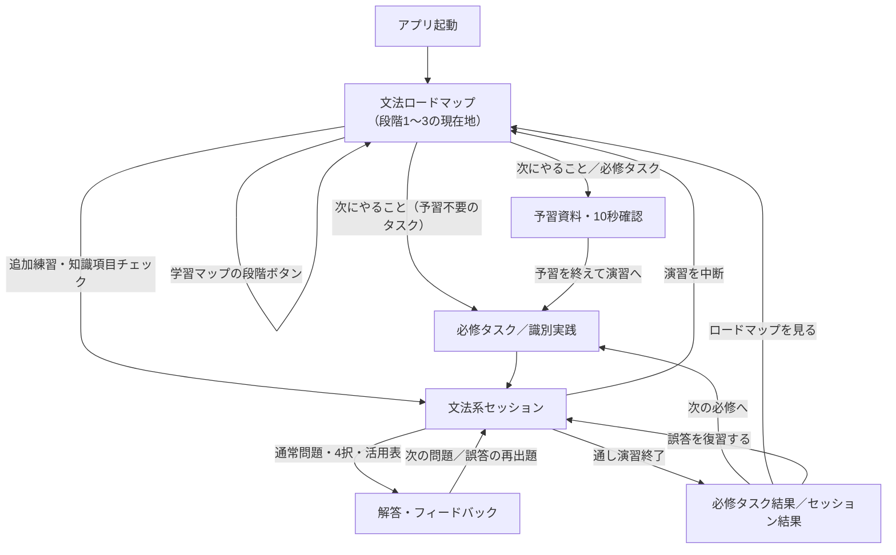
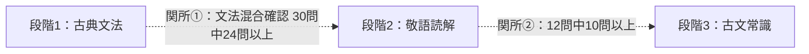

# 古典文法演習 画面遷移図

> 古典文法専用アプリ（v2.1、古文単語モード削除後）の画面・状態遷移の正本。画面は別URLへ遷移せず、`index.html` 内のホーム領域と演習領域を切り替えて表示する。

- 作成日：2026-08-17
- 対象：`kobun-practice-v2.1`（古典文法演習）
- 起動時の入口：文法ロードマップ（段階1：古典文法）
- 主要モード：古典文法（単一アプリ、モード切替なし）
- 画面制御：`static/app.js`、`static/mode-katsuyo.js`、`static/kobun-preparation.js`
- 全体フロー表示：`static/learning-map.js`

## 1. 全体の画面遷移

段階2（敬語読解）・段階3（古文常識）も `GTASK`／`GSESSION`／`GFEEDBACK`／`GRESULT` の同じ画面構成を共有する。学習マップの段階ボタンはページ内アンカー（`#grammarStage`／`#readingStage`／`#cultureStage`）へスクロールするだけで、別画面へは遷移しない。

## 2. 画面一覧

| ID | 画面 | 役割 | 主な入口 | 主な出口 |
|---|---|---|---|---|
| `GHOME` | 文法ロードマップ | 学習マップ（段階1〜3の現在地）、次にやること、段階別タスク一覧を表示する | 起動、各種結果、演習中断 | 予習資料、必修タスク、文法系セッション |
| `GPREP` | 予習資料・10秒確認 | Markdown予習資料を投稿形式で表示し、各見出しに1問の10秒確認を置く | ロードマップの「次にやること」「予習」ボタン | 必修タスク、ロードマップに戻る |
| `GTASK` | 必修タスク／識別実践 | 選択された必修タスクの実行単位（通常問題・識別実践） | ロードマップ、予習資料 | 文法系セッション |
| `GSESSION` | 文法系セッション | 活用表、4択、複数選択、識別実践、敬語読解、古文常識を出題する | ロードマップ、タスク、追加練習 | フィードバック、結果、ロードマップ |
| `GFEEDBACK` | 解答・フィードバック | 正誤と根拠（識別手順の場合は参照カード）を表示する | 文法系セッション | 次の問題 |
| `GRESULT` | 必修タスク結果／セッション結果 | 必修完了、チェックポイント合否、次タスクを表示する | 文法系セッション | 次の必修、ロードマップ、復習 |

## 3. 学習段階と完了条件

段階2・3の問題は、前段階の完了を待たずに選択できる。矢印は問題への開放ではなく、学習マップが示す「現在地」の完了条件と推奨順である。

### 段階1：古典文法

必修1〜9を次の順で学習する構成だが、問題はすべて選択できる。

1. 文の骨組み
2. 用言の活用
3. 未然形接続の助動詞
4. 連用形接続の助動詞
5. 終止形接続の助動詞
6. 体言・連体形接続の助動詞
7. 助詞・呼応・文末
8. 同形語の識別
9. 敬語・補助動詞
10. 文法混合確認（仕上げ）

通常問題は各問題を1回以上正解すると必修完了となる。識別問題は予習資料で手順を確認したうえで実践（傍線部の意味4択）に進む。最後の文法混合確認は30問のチェックポイントで、24問以上を合格とする。

### 段階2：敬語読解

「敬意の方向を読む → 省略主語を補う → 短文読解で統合 → 敬語読解チェック」の順に進む。前半の短文タスクは各問題を累計2回正解し、最後の12問チェックで10問以上正解すると段階2を完了する。

### 段階3：古文常識

「宮廷生活を読む → 恋愛・婚姻を読む → 年中行事を読む → 古文常識チェック」の順に進む。前半の短文タスクは各問題を累計2回正解し、最後の12問チェックで10問以上正解すると全課程修了となる。

## 4. 状態別の戻り先

| 状態 | 遷移先 |
|---|---|
| ホーム表示 | 文法ロードマップ |
| 演習中断 | 現在の文法ホーム（ロードマップ） |
| 通常セッション完了 | 必修タスク結果またはセッション結果 |
| 誤答あり | セッション末尾で再出題、または結果から復習 |
| 必修完了 | 次の必修タスク、またはロードマップ |
| チェック不合格 | 該当チェックポイントを再挑戦 |
| チェック合格 | 次段階のタスクを解放（表示上の推奨順） |

## 5. 実装上の状態管理

| 状態 | 保存先・識別子 | 画面遷移への影響 |
|---|---|---|
| 文法進捗 | `localStorage: kobun-katsuyo-progress-v2` | タスク完了、苦手復習、再出題を決める |
| 文法ロードマップ・チェックポイント | `localStorage: kobun-katsuyo-path-v2` | 次タスクと段階2・3の完了状態を決める |
| 予習・10秒確認の進捗 | `localStorage: kobun-preparation-progress-v1` | 予習資料の再開位置を決める |
| 生徒別クラウド同期 | クラウドappId `kobun-katsuyo-v2`（共有URL `?s=&t=`、`static/config.json` がある場合のみ） | 上記3キーの進捗を生徒間で共有する |

旧単語モードのlocalStorage（単語進捗・範囲指定・セッション用の各種キー）は、ブラウザに残っていてもアプリからは参照されない。今回の再構築では自動削除しない。

## 6. 遷移設計上の注意

- モード切替タブは廃止した。起動直後から文法ロードマップだけが表示される。
- 段階2・3は独立したタブではなく、同じロードマップ内のセクション（`#readingStage`／`#cultureStage`）として表示される。
- 学習マップの段階ボタンは別画面への遷移ではなく、対応するセクションへのページ内スクロールである。
- 「演習を中断」はロードマップへ戻る操作であり、進捗は解答時点まで保存される。
- 文法・敬語読解・古文常識のチェックポイントは、それぞれ独立した合否状態を持つ。

## 7. 参照実装

- [`index.html`](../index.html)：ホーム領域、演習領域
- [`static/app.js`](../static/app.js)：起動時の入口、共通キーボードイベント
- [`static/mode-katsuyo.js`](../static/mode-katsuyo.js)：段階1〜3のロードマップ、セッション、識別フロー
- [`static/kobun-preparation.js`](../static/kobun-preparation.js)：予習資料・10秒確認
- [`static/learning-map.js`](../static/learning-map.js)：段階1〜3の全体フローと現在地
